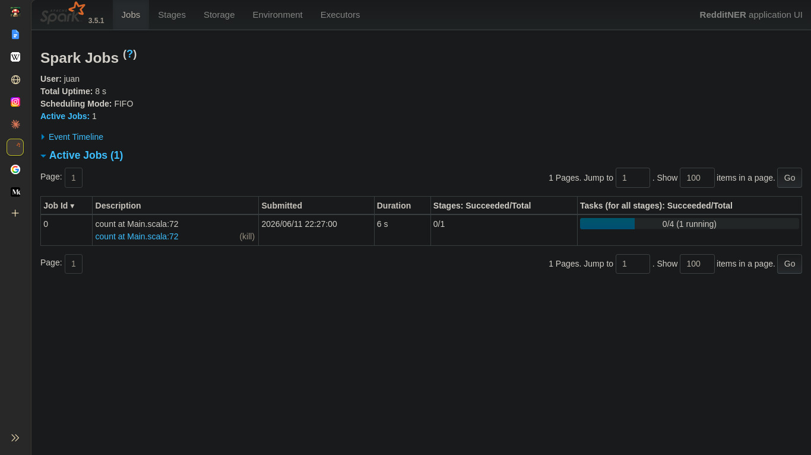
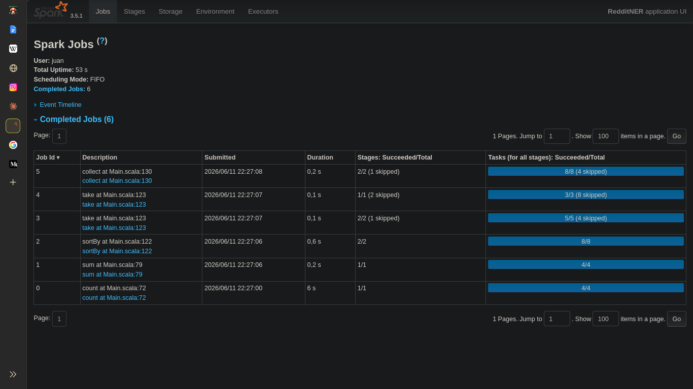
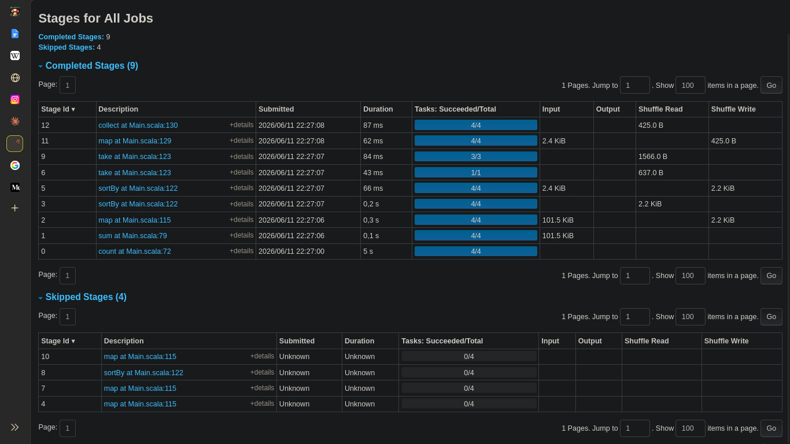
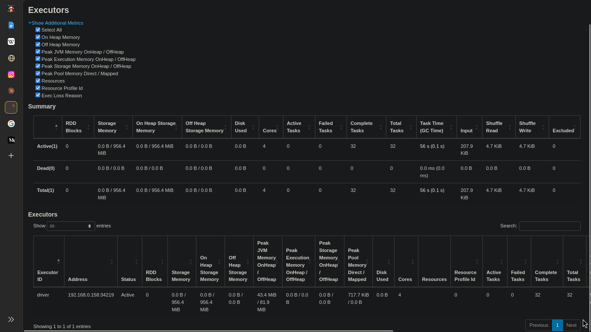
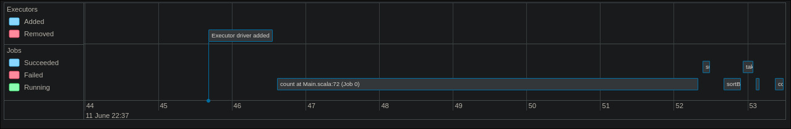
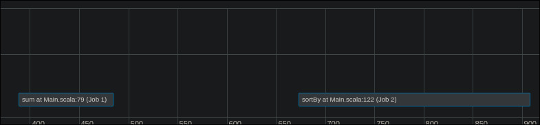
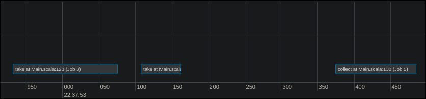

# Informe — Laboratorio 3: Procesamiento distribuido con Apache Spark

**Materia:** Paradigmas de Programación 2026 — FAMAF  
**Grupo:** g06  
**Integrantes:**
- Lopez Benavides Francisco
- Brizuela Franco
- Prieto Ale
- Hernandez Juan Martin

---

## Decisiones de diseño relevantes

<!-- Completar -->

---

## Ejercicio 1 — Identificar las regiones paralelizables

### a) Diagrama de flujo del pipeline
```
[subscriptions.json]    (o cualquier .json)
           |
           | String (ruta del archivo)
           v
  1. Leer suscripciones
     (FileIO.readSubscriptions)
           |
           | List[Option[Subscription]]  →  flatten  →  List[Subscription]
           v
  2. sc.parallelize + descargar feeds (HTTP)
     (FileIO.downloadFeed — dentro de flatMap sobre RDD[Subscription])
           |
           | RDD[Post]   (todos los posts de todos los feeds)
           v
  3. Parsear posts de cada feed
     (JsonParser.parsePosts — dentro del mismo flatMap)
           |
           | RDD[Post]   (posts parseados)
           v
  4. Filtrar posts vacíos
     (Analyzer.isEmptyPost — filter sobre RDD[Post])
           |
           | RDD[Post]   (posts válidos)   ← .cache()
           v
  5. Detectar entidades en cada post
     (Analyzer.detectEntities — flatMap sobre RDD[Post])
           |
           | RDD[NamedEntity]   (todas las entidades de todos los posts)
           v
  6. Contar entidades  [barrera: shuffle]
     (map → ((entityType, text), 1)  luego  reduceByKey(_ + _))
           |
           | RDD[((String, String), Int)]   ← .cache()
           v
  7. Ordenar y mostrar el ranking
     (sortBy + take(topK) → Formatters.formatEntityStats
      reduceByKey por tipo → Formatters.formatTypeStats)
           |
           | String (salida por consola)
           v
        [stdout]
```


### b) Clasificación de pasos según abstracciones de Spark

| Paso | Abstracción Spark | Justificación |
|------|-------------------|---------------|
| Leer Subscripciones | No aplica | Se ejecuta en el driver antes de crear algun RDD, el resultado de este paso es luego la estructura de datos que vamos a paralelizar |
| Descarga de feeds y Parseo | `flatMap` | Cada Subscription genera 0 o algun post, estos luego se parsean individualmente. Cada uno es independiente entre si |
| Filtrado de posts | `flatMap` | En este caso se filtran aquellos posts vacios (genera una cantida nula) o se dejan, cada post se evalua independientemente |
| Deteccion de entidades | `flatMap` | El procesamiento de cada post individualmente genera (detecta) una cantidad variable de entidades |
| Conteo de entidades | `map` / `reduceByKey` | Se transforma cada entidad en un par (entidad, cantidad), para luego combinar entidades semejantes y sumar sus cantidades |
| Ordenamiento y Estadisticas | No aplica | A pesar de poder realizar un ordenamiento parcial entre las partes, se necesitan los datos finales (de todos los workers) para ordenar y posteriormente mostrar por pantalla las estadisticas. No tiene sentido aqui la paralelización|

**¿Hay algún paso que no encaje en ninguna abstracción?**

Sí, varios. La lectura de suscripciones ocurre íntegramente en el driver antes de que exista un RDD. El `count()` sobre `filteredPosts`, el `take(topK)` sobre el RDD ordenado, y el `collect()` para construir `typeStats` son **acciones**, no transformaciones: no producen un nuevo RDD sino que extraen datos al driver. Estos pasos son necesarios porque el programa necesita tomar decisiones de control de flujo (verificar si `postCount == 0`) o producir la salida final, cosas que solo el driver puede hacer.


### c) Barreras de sincronización

**Pasos con barrera de sincronización:**
 
- `reduceByKey(_ + _)` para el conteo de entidades: para combinar los conteos parciales de todos los workers, Spark necesita redistribuir los pares clave-valor de forma que todos los pares con la misma clave queden en la misma partición. Esto produce un **shuffle**: ningún worker puede producir su resultado parcial hasta haber recibido todos los pares que le corresponden. Lo mismo ocurre con el segundo `reduceByKey` que agrega conteos por tipo.
- `sortBy`: requiere un shuffle global para ordenar el RDD entre particiones.
- `count()`, `take()`, `collect()`: son acciones que obligan al driver a esperar a que todas las tareas de todos los stages anteriores hayan completado antes de devolver un valor. Son barreras absolutas: nada posterior puede comenzar hasta que terminen.
**Pasos completamente independientes entre workers:**
 
- `flatMap` de descarga y parseo: cada worker procesa su `Subscription` de forma totalmente aislada. El fallo de un feed no afecta al resto.
- `filter` de posts vacíos: cada worker evalúa sus `Post` localmente, sin necesitar datos de otras particiones.
- `flatMap` de detección de entidades: cada worker aplica `detectEntities` a sus posts de forma independiente.
- `map` que genera los pares `((entityType, text), 1)`: transformación uno a uno, completamente local por elemento.


**Pasos completamente independientes entre workers:**

- `flatMap` de descarga y parseo: cada worker procesa su `Subscription` de forma totalmente aislada. El fallo de un feed no afecta al resto.
- `filter` de posts vacíos: cada worker evalúa sus `Post` localmente, sin necesitar datos de otras particiones.
- `flatMap` de detección de entidades: cada worker aplica `detectEntities` a sus posts de forma independiente.
- `map` que genera los pares `((entityType, text), 1)`: transformación uno a uno, completamente local por elemento.


### d) Restricciones sobre las funciones pasadas a Spark


**Serialización:**
 
Toda función que se pase a una transformación de Spark (`flatMap`, `map`, `filter`, etc.) se serializa y se envía a los workers a través de la red. Esto implica que tanto la función en sí como cualquier objeto que capture del scope externo deben ser serializables. En nuestro proyecto, `NamedEntity` extiende `Serializable` explícitamente por esta razón. El `dictionary` que se captura dentro del `flatMap` de detección de entidades es una `List[NamedEntity]` que también debe ser serializable para poder enviarse a cada worker. Si un objeto capturado no es serializable, Spark lanza una `NotSerializableException` en tiempo de ejecución.
 
**Estado compartido:**
 
Las funciones distribuidas no deben leer ni escribir estado mutable compartido entre workers. El acceso concurrente desde múltiples workers a una variable externa produciría condiciones de carrera y resultados incorrectos. Los únicos mecanismos seguros que provee Spark son los **Accumulators** (los workers solo pueden incrementarlos, el driver solo puede leerlos) y las **Broadcast variables** (el driver serializa el valor una sola vez y los workers solo pueden leerlo). En nuestro código, los cinco `LongAccumulator` siguen este contrato correctamente.
 
**Efectos secundarios:**
 
Las funciones pasadas a Spark deben ser lo más puras posible. Spark puede re-ejecutar una tarea ante un fallo o en modo especulativo, lo que significa que la misma función puede ejecutarse más de una vez sobre el mismo dato. Los `Console.err.println` dentro del `flatMap` de descarga son un ejemplo de efecto secundario tolerable (logging), pero si un efecto secundario fuera una escritura a una base de datos o un incremento de contador externo, podría ejecutarse múltiples veces y producir resultados incorrectos. Por la misma razón, los `Accumulator` pueden sobrecontar si una tarea se re-ejecuta, por eso no deben usarse para tomar decisiones lógicas del pipeline.
 

## Ejercicio 2 — Paralelizar la descarga de feeds

### ¿Qué pasaría si se dejara propagar la excepción dentro del flatMap en lugar de manejarla internamente?

Si una excepción se propaga fuera de la función pasada al flatMap, Spark marca la tarea como fallida y la reintenta. Si sigue fallando, cancela el stage completo y el job entero falla con una excepción. Esto significa que un solo feed inalcanzable haría fallar todo el programa, perdiendo el trabajo de todos los demás feeds ya descargados.

Al manejar el error internamente capturando la excepción el worker simplemente emite cero posts para ese feed y continúa con los demás. El pipeline sigue con los feeds que sí funcionaron.


---

## Ejercicio 3 — Paralelizar el cómputo de entidades nombradas

### `reduceByKey` como barrera de sincronización

> ¿Qué ocurre en el cluster en el punto de `reduceByKey`? ¿Por qué es inevitable para este problema?

En este punto, al querer contar la cantidad de entidades detectadas, un **worker** pudo haber encontrado *"Juan"* y un **worker** distinto otro *"Juan"*, para que la suma de entidades sea la correcta y se detecten a todos los *"Juan"* de todos los **worker**, `reduceByKey` produce un **Shuffle**, esto hace que todos los **workers** se detengan un momento y se envíen los datos entre ellos para asegurarse de que todas las entidades con el mismo nombre se agrupen juntas en un mismo **worker** antes de hacer la suma final y enviar el resultado al driver. Este **Shuffle** es inevitable ya que para poder tener el conteo total de todas las entidades es necesario combinar los conteos parciales de todos los **workers** que hayan encontrado esa entidad.

### Restricciones de la función pasada a `reduceByKey`

> ¿Qué restricciones debe cumplir la función que se le pasa a `reduceByKey`? Pensar en conmutatividad y asociatividad.

La función debe ser asociativa, para que Spark pueda combinar parcialmente resultados en cualquier orden; y conmutativa, para que el orden en que lleguen los valores no afecte el resultado. La suma de enteros cumple ambas propiedades.

### ¿Dónde se lee el diccionario de entidades?

> ¿La lectura del diccionario de entidades ocurre en el driver o en los workers?

En nuestra implementación, la lectura del diccionario desde el disco ocurre en el Driver, ya que la función `Dictionary.loadAll()` se invoca en el flujo principal del programa, fuera de cualquier transformación de Spark.

Como la variable `dictionary` es referenciada posteriormente dentro de la función `flatMap`, Spark captura esta variable en la **clausura (closure)** de la función. Para que los workers puedan utilizarla, el Driver serializa la lista del diccionario y la envía a través de los hilos hacia la memoria de cada worker.

Esta decisión de diseño evita que cada worker tenga que realizar operaciones lentas de I/O de forma redundante y concurrente, garantizando que ya tengan la estructura en memoria lista para procesar su partición de datos.

---


## Ejercicio 4 — Monitoreo del éxito de las tareas

### a) y b) Accumulators y estadísticas

El pipeline incorpora cinco `LongAccumulator` definidos en el driver antes de ejecutar cualquier transformación:

| Accumulator | Qué mide |
|---|---|
| `feedsSuccessAcc` | Feeds descargados con éxito |
| `feedsFailedAcc` | Feeds que fallaron (timeout, error HTTP o contenido inválido) |
| `postsDownloadedAcc` | Posts descargados en total |
| `postsFailedAcc` | Feeds cuyo parseo no produjo ningún post |
| `postsFilteredAcc` | Posts descartados por tener título o selftext vacío |

Estos cinco valores se imprimen por pantalla a través de `Formatters.formatProcessingStats` luego de la primera acción terminal del pipeline (`filteredPosts.count()`).

### c) Medición de tiempos

Se midieron dos puntos del pipeline con `System.currentTimeMillis()`:

- **Stage 1** — desde antes de `filteredPosts.count()` hasta después: cubre la descarga de feeds, el parseo, el filtrado y el cómputo del largo promedio.
- **Stage 2** — desde antes de `entitiesCounts.sortBy(...).take(topK)` hasta después: cubre la detección de entidades, el `map`, el `reduceByKey` y el ordenamiento final.

---

### Análisis de la Spark UI

#### Jobs

Durante la ejecución se dispararon jobs a medida que el driver ejecutaba acciones terminales. La siguiente captura muestra el Job 0 en ejecución, disparado por el `count` en `Main.scala:72`, con 6 segundos de duración y un stage aún activo:



Una vez completada la ejecución completa, la UI registró **6 jobs completados**:

| Job | Acción terminal | Duración | Stages ok/total |
|-----|----------------|----------|-----------------|
| 0 | `count` at Main.scala:72 | 6 s | 1/1 |
| 1 | `sum` at Main.scala:79 | 0,2 s | 1/1 |
| 2 | `sortBy` at Main.scala:122 | 0,6 s | 2/2 |
| 3 | `take` at Main.scala:123 | 0,1 s | 1/1 (2 skipped) |
| 4 | `take` at Main.scala:123 | 0,1 s | 1/1 (2 skipped) |
| 5 | `collect` at Main.scala:130 | 0,2 s | 2/2 (1 skipped) |



Cada job corresponde a una acción del pipeline. El Job 0 es el más largo (6 s) porque materializa todo el pipeline de descarga, parseo y filtrado desde cero. Los jobs posteriores son mucho más rápidos porque operan sobre `filteredPosts` y `entitiesCounts`, que ya están cacheados en memoria.

#### Stages completados y skipped

Se completaron **9 stages** y se saltearon **4**:



| Stage | Descripción | Duración | Tareas | Shuffle Write |
|-------|-------------|----------|--------|---------------|
| 0 | `count` at Main.scala:72 | 5 s | 4/4 | — |
| 1 | `sum` at Main.scala:79 | 0,1 s | 4/4 | — |
| 2 | `map` at Main.scala:115 | 0,3 s | 4/4 | 2.2 KiB |
| 3 | `sortBy` at Main.scala:122 | 0,2 s | 4/4 | 2.2 KiB |
| 5 | `sortBy` at Main.scala:122 | 66 ms | 4/4 | 2.2 KiB |
| 6 | `take` at Main.scala:123 | 43 ms | 1/1 | 637.0 B |
| 9 | `take` at Main.scala:123 | 84 ms | 3/3 | 1566.0 B |
| 11 | `map` at Main.scala:129 | 62 ms | 4/4 | 425.0 B |
| 12 | `collect` at Main.scala:130 | 87 ms | 4/4 | — |

Los **4 stages skipped** (IDs 4, 7, 8, 10) corresponden a recomputaciones que Spark evitó gracias a `.cache()`. Al tener `filteredPosts` y `entitiesCounts` persistidos en memoria, los jobs 3, 4 y 5 no necesitaron reejecutar los stages de descarga ni de reducción; Spark los marcó directamente como skipped y leyó desde caché.

Los stages con **Shuffle Write** corresponden a las operaciones que redistribuyen datos entre particiones: el `reduceByKey` de conteo de entidades y el `sortBy` del ranking. Son las barreras de sincronización visibles del pipeline.

#### Executors



La ejecución se realizó en **modo local** (`local[*]`), por lo que hubo un único executor que además actúa como driver:

| Métrica | Valor |
|---|---|
| Executor activo | 1 (driver, `192.168.0.158`) |
| Cores disponibles | 4 |
| Tareas completadas | 32 |
| Task time total | 56 s (GC: 0,1 s) |
| Input leído | 207.9 KiB |
| Shuffle Read | 4.7 KiB |
| Shuffle Write | 4.7 KiB |

Con 4 cores y 32 tareas totales, cada stage de 4 tareas se ejecutó completamente en paralelo dentro de la misma máquina.

#### Event Timeline

El timeline muestra los 6 jobs ejecutados en secuencia. El Job 0 (`count`) ocupa la mayor parte del tiempo total, desde las 22:37:44 hasta las 22:37:52 aproximadamente:



Los jobs 1 (`sum`) y 2 (`sortBy`) se ejecutan a continuación, separados en el tiempo porque el driver necesita el resultado del `count` antes de poder calcular el promedio y luego lanzar el pipeline de NER:



Finalmente los jobs 3, 4 (`take`) y 5 (`collect`) completan la ejecución, con duraciones muy cortas gracias al caché:



Los 6 jobs se ejecutan en secuencia estricta: ningún job comenzó hasta que terminó el anterior. Esto es esperable porque el pipeline tiene dependencias de datos entre jobs — el Job 1 necesita el resultado del `count` del Job 0 para calcular el promedio; el Job 2 necesita `entitiesCounts` que a su vez depende de `filteredPosts`. La ejecución secuencial entre jobs no es un problema de paralelismo sino una consecuencia del modelo de control de flujo del driver.

---

### Preguntas conceptuales

**¿Por qué los Accumulators solo deben usarse para métricas y no para tomar decisiones lógicas dentro de las etapas distribuidas del pipeline? ¿En qué situación puede dar un valor incorrecto?**

Spark puede re-ejecutar una tarea ante un fallo o lanzar una tarea especulativa en otro worker para reducir el tiempo de espera. En ambos casos, la función del worker se ejecuta más de una vez sobre el mismo dato, y el Accumulator se incrementa múltiples veces para esa entrada. Durante la ejecución, el driver no puede distinguir si el valor actual refleja exactamente las entradas procesadas o incluye conteos duplicados por re-ejecuciones. Por eso, usar un Accumulator para tomar una decisión lógica dentro de un `flatMap` o `filter` produciría resultados incorrectos: la condición podría evaluarse sobre un valor inflado. En nuestro código, los Accumulators solo se leen en el driver después de una acción terminal, lo cual es el uso correcto.

**¿En qué momento del pipeline está disponible el valor de un Accumulator para ser leído por el driver?**

El valor de un Accumulator solo es confiable después de que una **acción terminal** (`count`, `collect`, `take`, `saveAsTextFile`, etc.) haya completado. Las transformaciones de Spark son lazy: hasta que no se ejecuta una acción, ningún worker ha corrido código y los Accumulators tienen valor cero. En nuestro pipeline, los Accumulators de feeds y posts se leen correctamente después de `filteredPosts.count()` en el stage 0, que es la primera acción y la que materializa el `flatMap` de descarga y el `filter`.

**Comparativa de tiempos: versión secuencial vs. Spark**

| Etapa | Secuencial (esqueleto) | Con Spark (local[*]) | Diferencia |
|-------|----------------------|----------------------|------------|
| Descarga + filtrado (`count`) | 20.25s | 5.51 s (Job 0) | 72,8% |
| NER + reducción (`sortBy`) | 0.05 s | 0.55 s (Job 2) | Spark es más lento |


Para el volumen de datos del laboratorio (pocos feeds, cientos de posts), **la versión con Spark no es más rápida que la secuencial**. La razón es que el overhead de Spark (inicialización del SparkContext, serialización de funciones y datos, scheduling de tareas, shuffle) supera el beneficio de la paralelización cuando el trabajo por tarea es pequeño. El cuello de botella real es la descarga HTTP, que en modo `local[*]` sí se paraleliza en 4 threads, pero con pocos feeds esa ganancia no compensa el overhead fijo. La ventaja de Spark se materializaría con cientos o miles de feeds, donde el trabajo distribuible domina sobre el overhead.


---

## Ejercicio 5 — Acceso a datos y persistencia de RDDs

### ¿Qué ocurriría sin `cache()`? ¿Cuántas veces se ejecutaría la descarga de feeds si no se llamara a `cache()`?

Sin `cache()`, cada acción sobre `filteredPosts` recomputaría todo el recorrido desde el principio: volvería a leer las suscripciones, descargar todos los feeds, parsear los posts y filtrar. En nuestro pipeline hay dos acciones sobre `filteredPosts` (count() y map(...).sum()), por lo que los feeds se descargarían dos veces. Con cache(), la primera acción materializa y almacena el RDD en memoria. La segunda acción lo reutiliza directamente sin recomputar.

### ¿Por qué es incorrecto llamar a collect() entre los pasos a) y b) del ejercicio 3 y continuar el pipeline? ¿Qué consecuencia tiene sobre la distribución del trabajo?

Llamar a `collect()` trae todos los datos al driver y devuelve un Array. Si se continua el pipeline a partir de ese punto, se opera sobre una colección local en el driver, no sobre un RDD. Cualquier transformación posterior (map, reduceByKey, etc.) se ejecutaría secuencialmente en el driver, sin distribución. Se pierde completamente la paralelización, el mayor beneficio de usar Spark. 


### `cache()` es lazy: ¿En qué momento se almacena realmente el RDD en memoria?

Notamos que `cache()` solo marca el RDD como "persistir cuando se materialice". El almacenamiento real ocurre cuando la primera acción sobre ese RDD se ejecuta. En nuestro código:

```scala
filteredPosts.cache()           // solo marca, no ejecuta nada
...
val postCount = filteredPosts.count()  // acá se materializa y se guarda en memoria
```
Las acciones subsiguientes sobre ese RDD leen directamente de la caché.

---

## Referencias

<!-- Opcional: listar documentación, artículos o recursos consultados -->

- [Documentación oficial de Apache Spark](https://spark.apache.org/docs/latest/)
- [Spark Programming Guide — RDDs](https://spark.apache.org/docs/latest/rdd-programming-guide.html)
- [Spark Accumulators](https://spark.apache.org/docs/latest/rdd-programming-guide.html#accumulators)